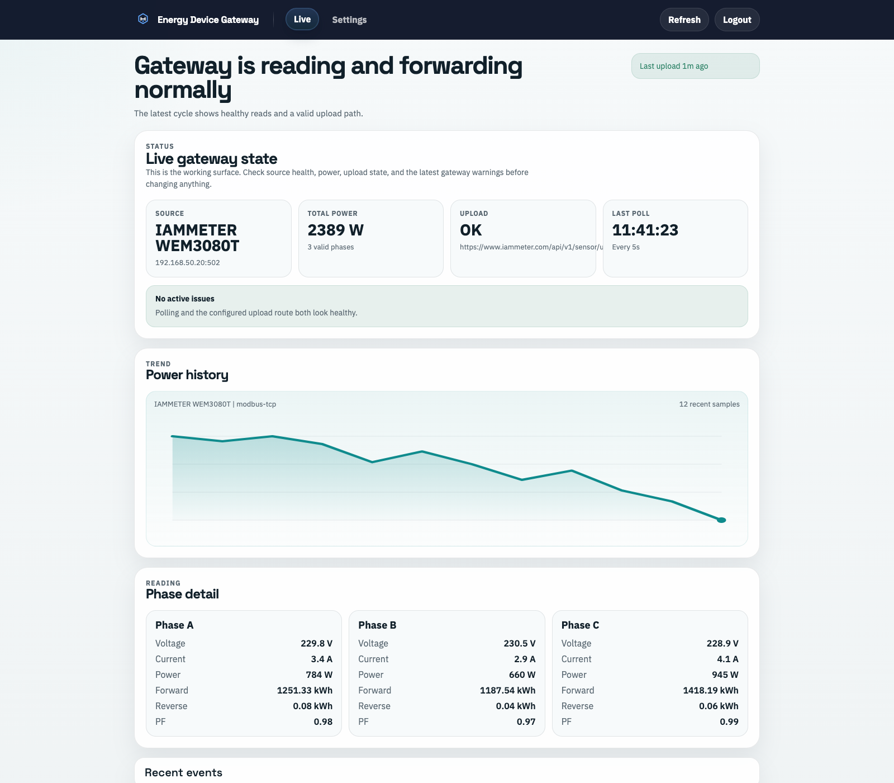
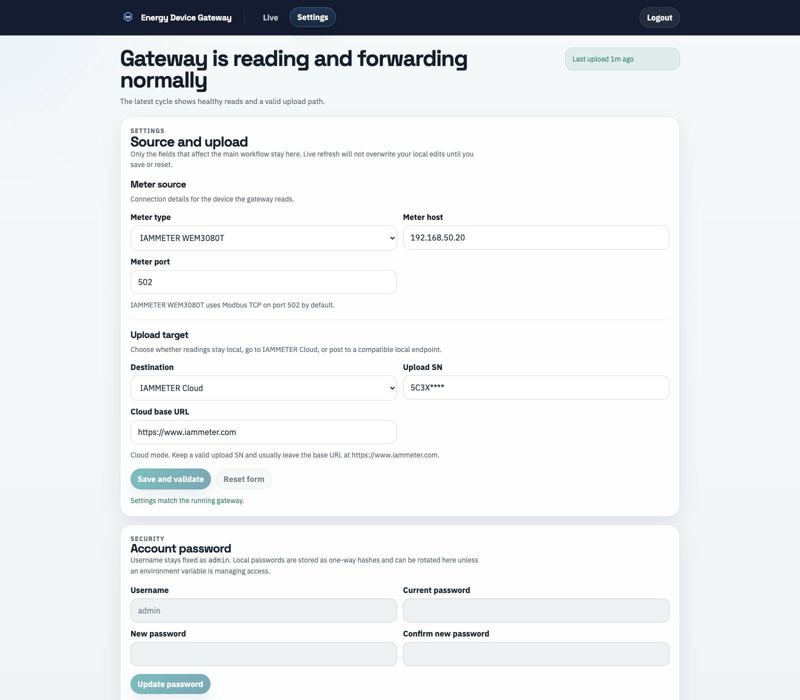

# Energy Device Gateway

`energy-device-gateway` is a Node.js + TypeScript gateway from [EnergyMeterHub](https://www.energymeterhub.com), built as the Docker and server-hosted counterpart to `energy-device-edge`.

It reads supported LAN energy devices, normalizes their output into one payload shape, serves an authenticated web console and API, and can forward data to IAMMETER Cloud or a compatible local endpoint.

This repository is one of EnergyMeterHub's in-house open-source projects.

## Supported Devices

| Device | Type String | Protocol | Default Port |
| --- | --- | --- | --- |
| IAMMETER WEM3080T | `IAMMETER_WEM3080T` | Modbus TCP | `502` |
| Fronius SunSpec Inverter | `FRONIUS_SUNSPEC` | SunSpec Modbus TCP | `502` |
| Shelly Pro 3EM | `SHELLY_3EM` | Shelly RPC HTTP | `80` |

Legacy aliases are normalized automatically:

- `IAMMETER` -> `IAMMETER_WEM3080T`
- `FRONIUS` -> `FRONIUS_SUNSPEC`
- `FRONIUS_GEN24` -> `FRONIUS_SUNSPEC`
- `SHELLY` -> `SHELLY_3EM`
- `SHELLY_PRO_3EM` -> `SHELLY_3EM`

## API

The gateway keeps the main edge-compatible endpoints:

- `GET /api/config`
- `POST /api/config`
- `POST /api/source`
- `POST /api/network`
- `GET /api/meter/data`
- `GET /api/wifi/scan`
- `POST /api/restart`
- `POST /api/factory-reset`
- `POST /api/ota`

`GET /api/meter/data` returns the IAMMETER-style upload payload shape used by the existing edge UI.

Gateway-specific endpoints:

- `POST /api/auth/bootstrap`
- `POST /api/auth/login`
- `POST /api/auth/logout`
- `GET /api/auth/session`
- `GET /api/runtime/status`
- `GET /api/runtime/history`
- `GET /api/runtime/events`
- `GET /api/meter/normalized`

## Web Console

The web console has two views:

- `Live` for runtime status, power trend, phase detail, recent events, and payload inspection
- `Settings` for source setup, upload target changes, password management, and service controls

The screenshots below use demo runtime data, and the upload SN is masked.

**Live**



**Settings**



## Development

Requirements:

- Node.js `22.6.0` or newer

Install and run:

```bash
npm install
npm run typecheck
npm test
npm run dev
```

Default server:

- `http://127.0.0.1:8080`

## Runtime Configuration

Environment variables:

- `PORT` - HTTP port, default `8080`
- `HOST` - bind host, default `0.0.0.0`
- `ENERGY_DEVICE_GATEWAY_CONFIG_PATH` - config file path, default `./data/config.json`
- `ENERGY_DEVICE_GATEWAY_PASSWORD_HASH` - preferred environment-managed password hash for the built-in `admin` account
- `ENERGY_DEVICE_GATEWAY_PASSWORD` - optional plaintext password override for local/dev compatibility; prefer the hash variable for published deployments
- `ENERGY_DEVICE_GATEWAY_POLL_INTERVAL_MS` - live polling interval, default `5000`
- `ENERGY_DEVICE_GATEWAY_UPLOAD_INTERVAL_MS` - upload interval, default `60000`
- `ENERGY_DEVICE_GATEWAY_SELF_RESTART` - if `true`, restart and factory-reset endpoints exit the process after responding

## Authentication

This project includes login protection for all gateway operations.

- the built-in username is always `admin`
- there is no built-in default password
- when no password is configured, the login screen switches to a one-time bootstrap flow and asks you to set the administrator password
- local passwords are stored as one-way `scrypt` hashes in the config file
- when `ENERGY_DEVICE_GATEWAY_PASSWORD_HASH` or `ENERGY_DEVICE_GATEWAY_PASSWORD` is set, that password is environment-managed and the UI cannot change it
- when running without an environment override, the password can be rotated from the web UI after login

Generate a password hash for `ENERGY_DEVICE_GATEWAY_PASSWORD_HASH`:

```bash
npm run auth:hash -- "correct horse battery staple"
```

Bootstrap example:

```bash
cp data/config.example.json data/config.json
npm run dev
```

Environment-managed example:

```bash
ENERGY_DEVICE_GATEWAY_PASSWORD_HASH="$(npm run --silent auth:hash -- 'change-me-now')" npm run dev
```

## Docker

Build and run:

```bash
docker build -t energy-device-gateway .
docker run --rm -p 8080:8080 -e ENERGY_DEVICE_GATEWAY_PASSWORD_HASH="$(npm run --silent auth:hash -- 'change-me-now')" energy-device-gateway
```

Mount a persistent config directory if needed:

```bash
docker run --rm -p 8080:8080 -v "$PWD/data:/app/data" energy-device-gateway
```

## Notes

- Wi-Fi fields remain in the API for compatibility, but are metadata only in the Docker-oriented gateway runtime.
- OTA uploads are stored under `data/uploads/latest-upload.bin` instead of flashing firmware directly.
- Restart and factory reset endpoints can optionally terminate the process so Docker can handle restart policy.
- `data/config.example.json` is safe to commit; runtime data under `data/` stays ignored.
- The gateway now carries its own logo asset and no longer depends on files from a sibling repository.
